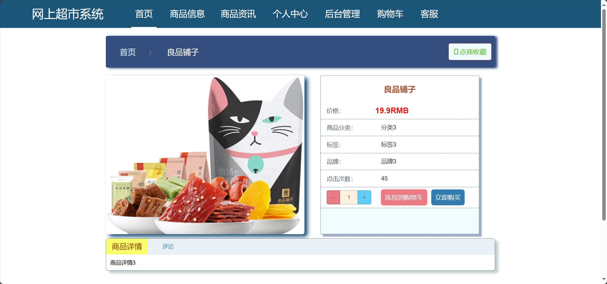
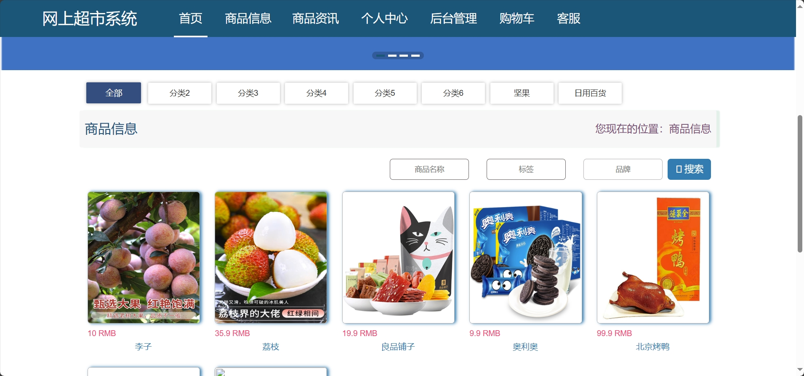
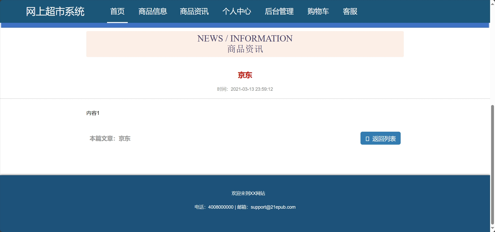
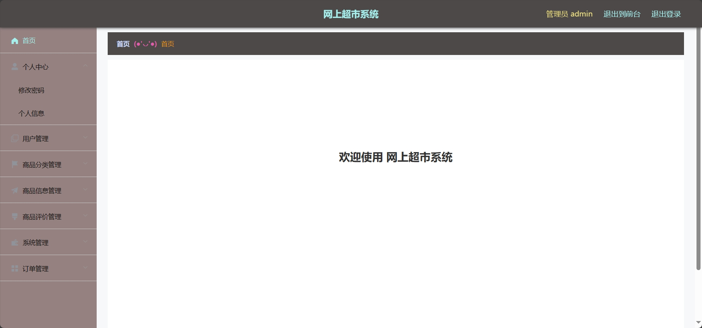
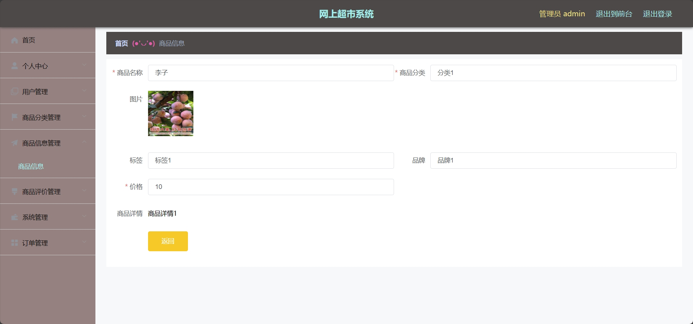
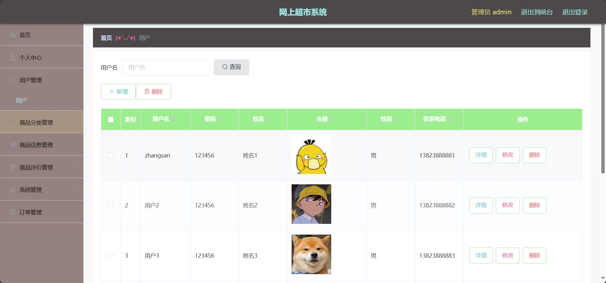

<h1 align="center">基于SSM的网上商城系统</h1>

 获取sql文件 QQ: 605739993 QQ群: 377586148 

 [个人站点: 从戎源码网](https://armycodes.com/)

## 简介

> 本代码来源于网络,仅供学习参考使用!
>
> 提供1.远程部署/2.修改代码/3.设计文档指导/4.框架代码讲解等服务
> 
> 管理端首页：http://localhost:8081/#/login
>
> 管理员: admin 密码: 123456
> 
> 用户端首页：http://localhost:8080/wangshangchaoshi/front/index.html
> 
> 用户：zhangsan 密码: 123456

## 项目介绍

基于SSM的网上商城系统：前端 Vue、ElementUI，后端 SpringBoot、Mybatis，系统角色分为：管理员和用户，管理员在管理后台管理商品，对公告进行发布，添加新商品分类、对相应数据进行统计、回复评论等；用户根据发布的商品进行购物等。主要功能如下：

### 启动方式

- 前端：

> cd src\main\resources\admin\admin
>
> npm install
>
> npm run serve

- 后端：

> 按钮启动 | 右键run SpringbootSchemaApplication

### 管理员：

- 基本操作：登录、修改密码、修改个人信息、上传图片、获取个人信息、联系客服
- 商品分类信息管理：获取商品分类列表、筛选商品分类信息、新增商品分类信息、删除商品分类信息、编辑商品分类信息
- 商品信息管理：获取商品列表、筛选商品信息、新增商品信息、删除商品信息、编辑商品信息、查看评论、回复评论、审核评论、统计评价
- 订单管理：获取订单列表、筛选订单信息、删除订单信息、编辑订单信息、查看订单详情、发货
- 轮播图管理：获取轮播图列表、筛选轮播图信息、删除轮播图信息、发布轮播图、修改轮播图内容
- 咨询管理：获取咨询列表、筛选咨询信息、删除咨询信息、发布咨询、修改咨询内容
- 用户管理：获取用户列表、筛选用户信息、修改用户信息、删除用户信息、添加用户信息

### 用户：

- 基本操作：登录、注册、修改个人信息、上传图片、获取个人信息、联系客服
- 商品模块：获取商品列表、获取推荐商品列表(根据点击量计算)、收藏商品、评价商品、添加购物车、立即购买、筛选商品、删除商品、修改评论内容、筛选评论
- 咨询模块：获取咨询列表、筛选咨询信息
- 订单模块：获取订单列表、删除订单、确认收货、评价订单、下单、支付、退款
- 个人中心：获取收货列表、添加收货地址、获取收货地址列表、删除收货地址

## 环境

- <b>IntelliJ IDEA 2020.3</b>

- <b>Mysql 5.7.26</b>

- <b>NodeJs 14.17.3</b>

- <b>Maven 3.6.3</b>

- <b>JDK 1.8</b>

## 运行截图

